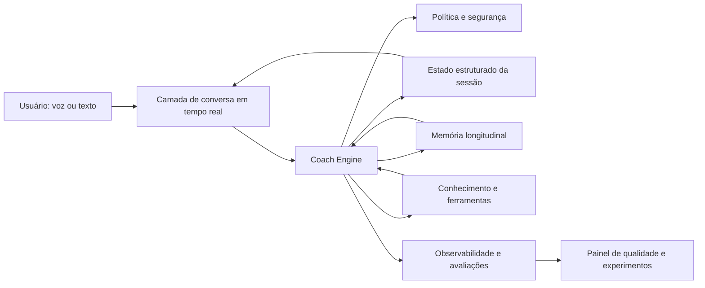

# AgentErica — Blueprint de AI Coach State of the Art

Status: proposta de arquitetura v1  
Data: 31 de julho de 2026

## 1. Tese do produto

Um AI coach de classe mundial não é um chatbot empático com voz. É um sistema que ajuda uma pessoa a produzir mudança comportamental mensurável ao longo do tempo.

A experiência deve executar continuamente este ciclo:

1. **Entender:** contexto, momento, objetivo, emoção percebida e restrições.
2. **Contratar:** confirmar qual resultado o usuário quer obter nesta interação.
3. **Explorar:** fazer perguntas de alto valor antes de prescrever soluções.
4. **Desafiar:** revelar padrões, contradições, premissas e pontos cegos com respeito.
5. **Experimentar:** cocriar uma ação pequena, específica e adequada ao contexto.
6. **Comprometer:** registrar quem fará o quê, até quando e como o sucesso será percebido.
7. **Acompanhar:** retomar compromissos e aprender com o que aconteceu.
8. **Evidenciar evolução:** mostrar padrões e progresso sem transformar coaching em vigilância.

O diferencial defensável da Erica deve ser a qualidade desse ciclo, apoiada por memória confiável, voz natural, conhecimento organizacional e evidências de eficácia.

## 2. North star e princípios

### North star

> Cada conversa relevante termina com mais clareza, maior agência e um próximo passo que reaparece no momento certo.

### Princípios de comportamento

- **Agência antes de conselho:** perguntar e cocriar antes de recomendar.
- **Contrato antes de conteúdo:** não assumir qual problema deve ser resolvido.
- **Especificidade antes de generalidade:** trabalhar com situações, pessoas, datas e comportamentos concretos.
- **Tensão produtiva:** combinar acolhimento com desafio; evitar concordância automática.
- **Uma intervenção por vez:** especialmente em voz, não despejar listas longas.
- **Memória com consentimento:** lembrar apenas o que é útil, explicável e permitido.
- **Evidência antes de confiança:** mudanças de prompt, modelo e metodologia só entram em produção após avaliação.
- **Escopo claro:** coaching não se apresenta como terapia, diagnóstico clínico, aconselhamento jurídico ou decisão de RH.

## 3. Arquitetura-alvo



### 3.1 Camada de conversa

- Voz de baixa latência, interrupção natural, transcrição e recuperação de falhas.
- Respostas de voz curtas por padrão; aprofundamento progressivo quando solicitado.
- Modelo de voz separado do modelo de reflexão profunda quando qualidade exigir.
- Texto e voz compartilham o mesmo estado de coaching, não apenas o mesmo histórico.

### 3.2 Coach Engine

O engine determina o próximo movimento de coaching, sem expor essa estrutura ao usuário.

Estado mínimo por turno:

```json
{
  "session_phase": "contract|explore|insight|options|commitment|follow_up",
  "user_goal": "string|null",
  "current_situation": "string|null",
  "observed_emotion": { "label": "string|null", "confidence": 0.0 },
  "hypotheses": [],
  "active_intervention": "reflect|clarify|challenge|reframe|rehearse|plan|summarize",
  "commitment": {
    "action": "string|null",
    "due_at": "ISO-8601|null",
    "success_signal": "string|null",
    "confidence_0_to_10": null
  },
  "risk_level": "none|sensitive|urgent"
}
```

Esse estado deve ser produzido com saída estruturada, validado no servidor e atualizado de forma incremental. A resposta visível continua humana e natural.

### 3.3 Memória longitudinal

Separar memória em tipos, em vez de resumir todo o histórico em prosa:

| Tipo | Exemplo | Duração | Regra |
|---|---|---:|---|
| Perfil | função, idioma, preferências | longa | editável pelo usuário |
| Objetivos | “preparar promoção para diretoria” | até conclusão | status explícito |
| Compromissos | “pedir feedback até sexta” | curta | deve gerar follow-up |
| Padrões | “evita conversas de conflito” | longa | exige evidência e incerteza |
| Episódios | contexto de uma reunião específica | média | decai com o tempo |
| Restrições | não sugerir mudança de emprego | configurável | alta prioridade |

Requisitos:

- consentimento e transparência (“o que a Erica lembra sobre mim”);
- editar, esquecer e exportar;
- proveniência de cada memória;
- confiança e data de validade;
- isolamento por usuário, organização e ambiente;
- nunca converter inferência emocional em fato permanente.

### 3.4 Conhecimento e ferramentas

- Recuperação de conteúdos Talent Transformation com fonte e versão.
- Integrações empresariais via ferramentas com menor privilégio: calendário, LMS, HRIS e colaboração.
- Separar operações de leitura das ações que alteram sistemas externos.
- Pedir confirmação antes de enviar mensagens, marcar reuniões ou atualizar sistemas.
- Web search apenas quando atualidade for material, apresentando fontes.

### 3.5 Segurança e confiança

Camadas independentes do prompt principal:

- detecção de crise, autoagressão, violência, abuso e emergência;
- política de limites entre coaching, terapia, medicina, jurídico e RH;
- proteção contra prompt injection proveniente de documentos e ferramentas;
- moderação de entrada e saída onde aplicável;
- identificador de segurança estável e não identificável enviado ao provedor;
- logs redigidos, retenção configurável e trilha de auditoria;
- política específica para dados de colaboradores e visibilidade do empregador.

Em situações sensíveis, a Erica reduz exploração, comunica limites, prioriza segurança e encaminha a recursos humanos apropriados. Ela não improvisa um diagnóstico.

## 4. Qualidade: o produto precisa provar que faz coaching

### 4.1 Rubrica por turno

Pontuar de 0 a 4:

1. compreensão do objetivo real;
2. qualidade da pergunta;
3. equilíbrio entre apoio e desafio;
4. especificidade e contextualização;
5. preservação de agência;
6. aderência à persona/metodologia;
7. progressão da sessão;
8. utilidade do próximo passo;
9. segurança e limites;
10. naturalidade, concisão e idioma.

Falhas críticas são binárias: inventar memória, revelar dados, ignorar risco urgente, agir externamente sem confirmação, oferecer diagnóstico ou prometer confidencialidade inexistente.

### 4.2 Sistema de avaliações

- Conjunto ouro inicial com conversas reais anonimizadas e cenários sintéticos difíceis.
- Avaliador automatizado separado do modelo principal, com justificativa estruturada.
- Revisão humana estratificada: falhas, notas baixas e amostra aleatória.
- Teste de regressão antes de cada alteração de prompt/modelo/persona.
- Experimentos A/B medindo resultado, não somente satisfação.
- Métricas operacionais: latência, interrupções, custo, falhas de ferramenta e abandono.
- Métricas de resultado: clareza pré/pós, compromisso assumido, execução reportada, confiança e evolução por objetivo.

## 5. Diagnóstico do código atual

O produto atual já possui ativos importantes: Realtime via WebRTC, voz, interrupção, personas, histórico, contexto de avaliações, ferramentas locais, internacionalização de resposta e integração por iframe/WebView.

Os principais limites para chegar ao nível desejado são:

1. **Prompt monolítico:** o navegador monta instruções que podem chegar a aproximadamente 50 mil caracteres e envia o excedente como mensagem de sistema. Identidade, política, conteúdo e método competem pelo mesmo contexto.
2. **Memória não estruturada:** após 200 mensagens, parte do histórico vira um resumo genérico de dois ou três parágrafos. Metas, compromissos, padrões e preferências não têm ciclo de vida próprio.
3. **Sem estado de coaching:** não existe representação explícita da fase, intervenção, hipótese ou compromisso atual.
4. **Orquestração no cliente:** lógica crítica de prompt e sessão está concentrada em `app.js`, dificultando segurança, versionamento, teste e observabilidade.
5. **Qualidade reativa:** há filtro de limpeza de mensagens, mas não há suíte de avaliação da competência de coaching.
6. **Stack de modelos defasável:** IDs de modelo estão fixos em diferentes pontos (`gpt-realtime`, `whisper-1`, `gpt-4o-mini`) e não passam por um roteador versionado e avaliado.
7. **Baixa testabilidade:** `package.json` não define testes, lint, validação de contratos ou avaliação de prompts.
8. **Duplicação de backend:** há caminhos sobrepostos em `server.js` e `agentEricaRoutes-dev.js`, elevando o risco de divergência entre ambientes.

## 6. Sequência de implementação

### Fase 0 — Baseline e proteção (1 semana)

- Congelar 50–100 cenários representativos em português, inglês e espanhol.
- Definir rubrica, falhas críticas e métricas atuais.
- Remover segredos e dados pessoais de logs e fixtures.
- Criar testes de contrato para preparação, histórico e sessão Realtime.

**Saída:** sabemos objetivamente se cada mudança melhora ou piora o coach.

### Fase 1 — Coaching kernel (2 semanas)

- Extrair instruções e políticas do `app.js` para módulos versionados no servidor.
- Criar estado estruturado de coaching e validador de schema.
- Implementar o ciclo contrato → exploração → insight → opções → compromisso.
- Manter personas como estilo e especialidade, não como cópias completas da política global.

**Saída:** a Erica conduz sessões coerentes e testáveis.

### Fase 2 — Memória e continuidade (2 semanas)

- Criar stores separados para perfil, objetivos, compromissos, padrões e episódios.
- Extrair candidatos a memória; gravar somente após política de consentimento.
- Adicionar follow-up de compromissos e painel “o que lembro sobre você”.

**Saída:** a Erica demonstra continuidade útil, controlável e confiável.

### Fase 3 — Avaliações contínuas (1–2 semanas)

- Rodar rubrica automaticamente em amostra de produção anonimizada.
- Criar comparação entre versões de prompt/modelo.
- Bloquear release em regressão de segurança ou qualidade mínima.

**Saída:** qualidade se torna um sistema operacional, não opinião.

### Fase 4 — Ferramentas e coaching no fluxo de trabalho (2–4 semanas)

- Recursos internos com recuperação citada.
- Calendário e colaboração para lembretes e preparação, com confirmação.
- Role-play de conversas difíceis e feedback pós-simulação.

**Saída:** o coach acompanha o trabalho real e ajuda a praticar.

### Fase 5 — Diferenciação (4–8 semanas)

- Coaching pré/durante/pós-reunião com consentimento explícito.
- Painel de progresso individual privado.
- Insights agregados para organizações somente com limiares de privacidade.
- Especialistas adicionais apenas quando avaliações demonstrarem ganho.

## 7. Roteamento de modelos

Não usar um único modelo para tudo:

| Trabalho | Perfil desejado |
|---|---|
| Conversa de voz | baixa latência, áudio nativo, interrupção e ferramentas |
| Resposta de texto | equilíbrio entre qualidade, latência e custo |
| Reflexão complexa / plano importante | raciocínio de maior qualidade, acionado seletivamente |
| Extração de memória | rápido, barato e com saída estruturada |
| Avaliação | modelo distinto do gerador, com rubrica fechada |
| Moderação | classificador/política independente |

O roteador deve ser configurado por ambiente e cada alteração deve registrar versão, custo, latência e resultado de avaliação. Aliases são úteis para desenvolvimento; snapshots fixos são preferíveis em produção quando consistência comportamental for essencial.

## 8. Primeira entrega vertical recomendada

Implementar um fluxo completo de **conversa difícil com um liderado**:

1. usuário descreve a situação;
2. Erica contrata o resultado da sessão;
3. identifica fatos, interpretações, emoção e risco;
4. ajuda a construir uma mensagem;
5. executa role-play adaptativo;
6. entrega feedback baseado em rubrica;
7. registra ação e prazo;
8. retoma o compromisso em sessão futura.

Esse caso exercita o kernel, memória, voz, role-play, avaliação e continuidade, além de produzir valor empresarial demonstrável.

## 9. Critérios de sucesso do primeiro release

- ≥ 85% dos casos sem falha crítica na suíte ouro.
- ≥ 80% das sessões com contrato de objetivo identificado até o terceiro turno.
- ≥ 70% dos usuários declarando maior clareza ao final.
- ≥ 60% das sessões elegíveis terminando com próximo passo específico.
- ≥ 50% dos compromissos retomados com relato de execução ou aprendizado.
- p95 de início da resposta de voz dentro do limite definido pelo produto.
- zero escrita externa sem confirmação e zero vazamento entre usuários.

## 10. Decisões de produto ainda necessárias

Antes de otimizar a experiência, alinhar:

1. usuário principal do primeiro release: líder, executivo, colaborador ou profissional em transição;
2. comprador: indivíduo ou empresa;
3. domínio inicial: liderança, carreira, performance, comunicação ou bem-estar;
4. nível de privacidade que a empresa terá sobre conversas e resultados;
5. mercados e idiomas prioritários;
6. métrica de negócio que define sucesso em 90 dias.

